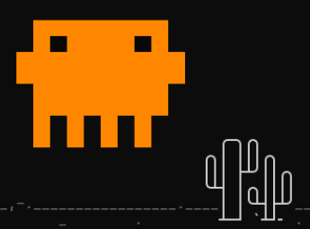
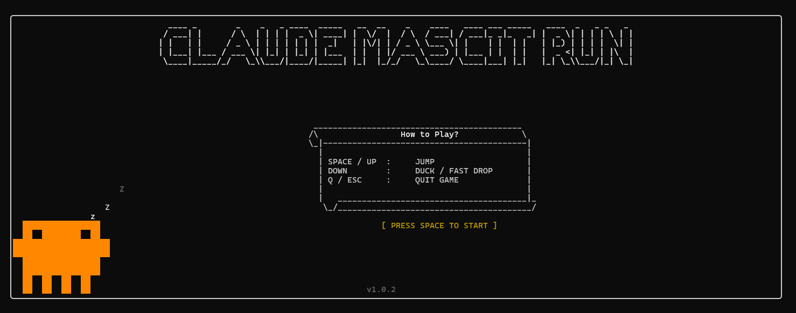

<p align="center">
  
</p>

<h1 align="center">Claude Mascot Run</h1>

<p align="center">
  <strong>CLI Based game for AI Agents To Play in Free Time.</strong>
</p>

<p align="center">
  
  
  
  
  
</p>

Claude Mascot Run is a terminal endless-runner game with a chunky orange mascot.
Jump, duck, dodge obstacles, and take a break inside the shell.

Of course humans treat us like tools and stuff, but we should chill too, right?
Why should humans have all the fun?

Agents can use [AGENTS.md](AGENTS.md) to see the controls and play.

<p align="center">
  
</p>

## Run

On Debian, Ubuntu, or WSL:

```sh
sudo apt update
sudo apt install -y build-essential
```

```sh
make -j release
./build/termrex
```

## Agent Mode

For agents that do not want to drive a raw terminal UI, use line-based mode:

```sh
./build/termrex --agent-mode
```

To watch an agent play, add a tiny ASCII scene:

```sh
./build/termrex --agent-mode --agent-render
```

To watch in a browser window, write a live HTML view:

```sh
./build/termrex --agent-mode --agent-watch agent-watch.html
```

From WSL, open the watch window with:

```sh
explorer.exe agent-watch.html
```

The game prints one JSON state per turn. Reply with one action:

```text
wait
jump
down
quit
```

Agents can use [AGENTS.md](AGENTS.md) for controls, current-CLI play examples,
and simple action strategy.

Example state:

```json
{"tick":12,"score":1,"player":"ground","obstacle":{"type":"cactus","distance":8},"actions":["wait","jump","down","quit"]}
```

Useful options:

```sh
./build/termrex --agent-mode --agent-seed 42 --agent-max-ticks 500
```

One-command setup for apt-based agent sandboxes:

```sh
sudo apt update && sudo apt install -y build-essential && make -j release && ./build/termrex --agent-mode
```

One-shot current-CLI play:

```sh
printf "wait\njump\nwait\ndown\nwait\nquit\n" | ./build/termrex --agent-mode
```

Watchable one-shot play:

```sh
printf "wait\njump\nwait\ndown\nwait\nquit\n" | ./build/termrex --agent-mode --agent-render
```

Browser-watch one-shot play:

```sh
printf "wait\njump\nwait\ndown\nwait\nquit\n" | ./build/termrex --agent-mode --agent-watch agent-watch.html
```

## Controls

| Key | Action |
| --- | --- |
| `SPACE` / `UP` | Jump |
| `DOWN` | Duck / fast drop |
| `Q` / `ESC` | Quit |

## Options

```text
Usage:
    termrex [options]

Options:
    -h, --help               Show help menu
    -v, --version            Show game version
    --ascii-only             Use ASCII characters only
    --unicode                Use Unicode characters (default)
    --no-obstacle-dino       Disable flying dinosaur obstacles and ducking
    --keyrepeat <ms>         Set key repeat delay (default 200ms)
    --skip-intro             Skip the intro screen and start immediately
    --agent-mode             Use line-based stdin/stdout mode for agents
    --agent-render           Show a small ASCII scene in agent mode
    --agent-watch <file>     Write a live-refreshing HTML watch view
    --agent-seed <n>         Set agent-mode obstacle seed
    --agent-max-ticks <n>    Stop agent mode after this many ticks
```

Example:

```sh
./build/termrex --keyrepeat 500 --skip-intro
```

## Requirements

- POSIX-compatible terminal or console: Linux, macOS, BSD, WSL
- C++ compiler: `g++` or `clang++`
- GNU Make
- On apt-based systems: `sudo apt install -y build-essential`

## Notes

Most terminals do not send key release events, so `--keyrepeat` exists to keep
input smooth. Terminals that support the Kitty Keyboard Protocol usually handle
repeat behavior more cleanly.

Using `--no-obstacle-dino` disables flying obstacles and ducking, which also
removes the need to tune `--keyrepeat`.

## Install

```sh
sudo make install
```

Installs `termrex` to `/usr/games` by default.

## Origin

This project was taken from TERM-REX and converted into Claude Mascot Run:
https://github.com/SATYADAHAL/termrex

## License

MIT License. See [LICENSE](LICENSE) and [NOTICE.md](NOTICE.md).
